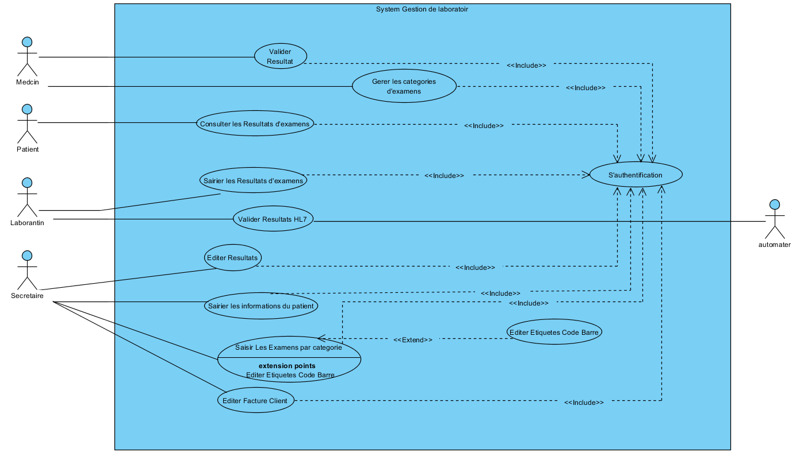
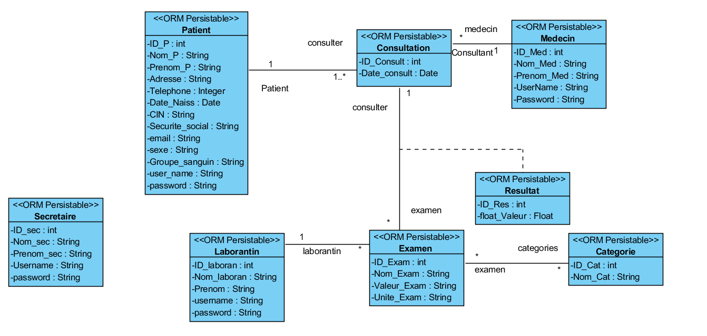
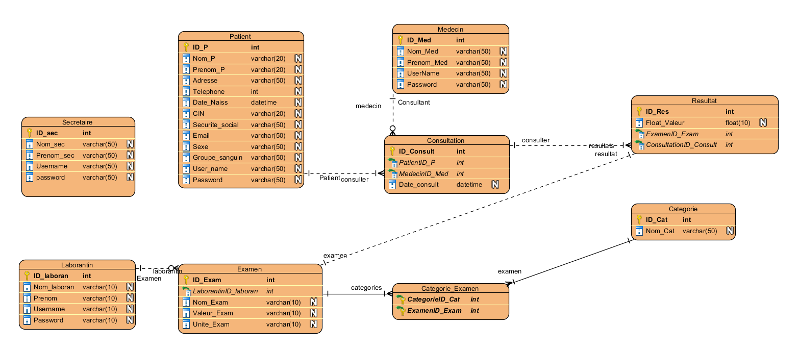
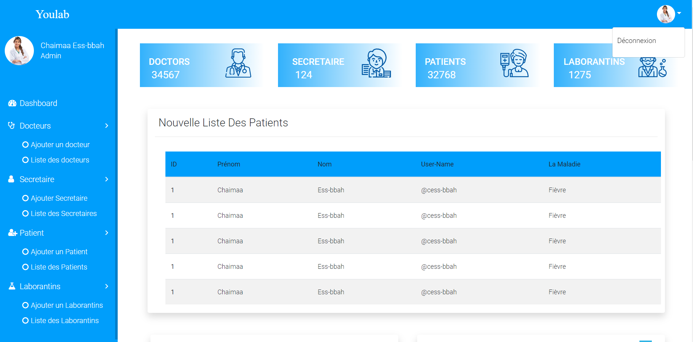
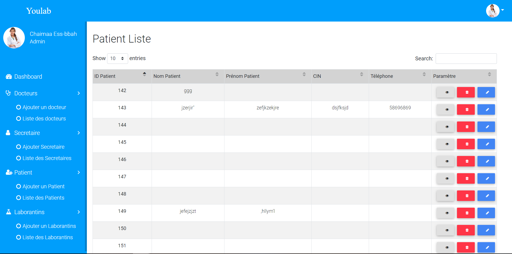
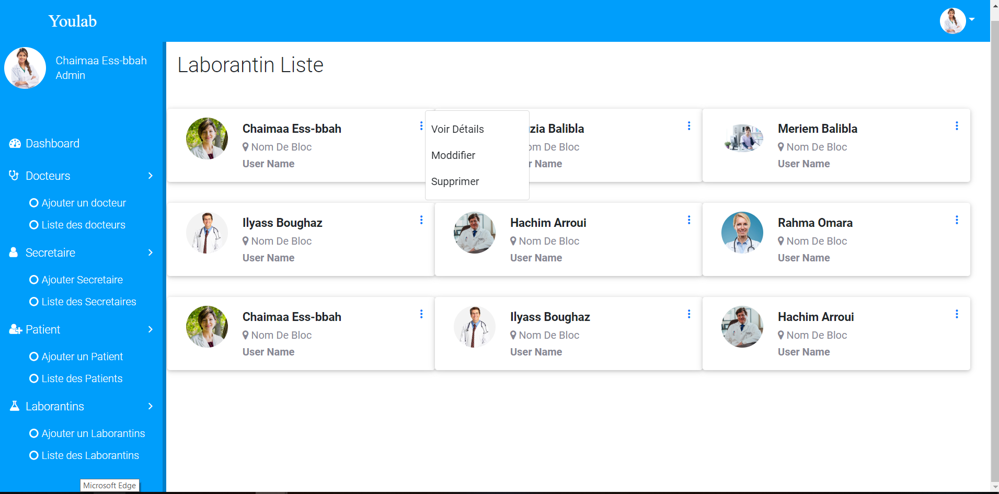
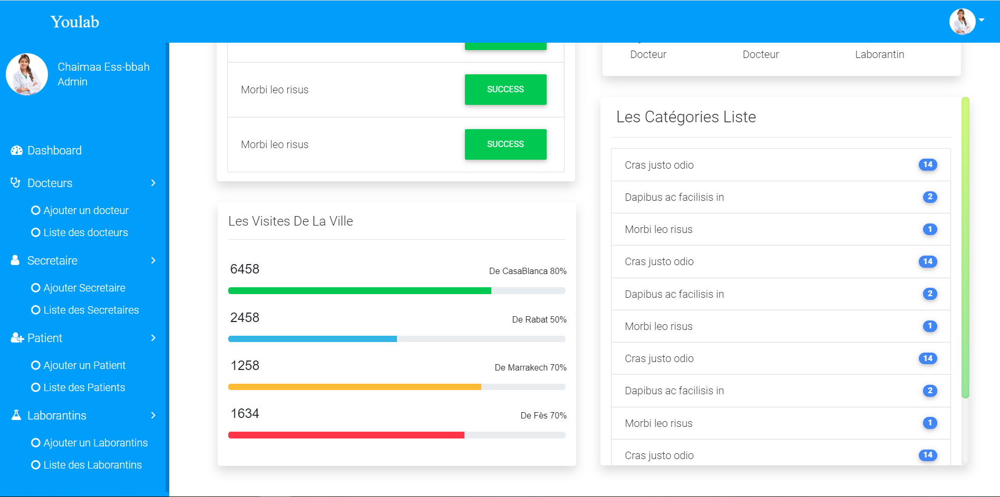

Pour le projet angular il faut installer les dépendance par la commande :
npm install

Pour asp.net webApi il faut créer une nouvelle base de donnée nommé :
YouLab.sql
coller dasn votre base donnée "YouLab" script SQL qui se trouve dans le dossier "YouLab"
execute pour générer les tableau :

```text
-- --------------------------------------------------
-- Entity Designer DDL Script for SQL Server 2005, 2008, 2012 and Azure
-- --------------------------------------------------
-- Date Created: 05/16/2020 15:46:28
-- Generated from EDMX file: C:\Users\Youcode\source\repos\YouLab\YouLab\Models\YouLabModel.edmx
-- --------------------------------------------------

SET QUOTED_IDENTIFIER OFF;
GO
USE [YouLab];
GO
IF SCHEMA_ID(N'dbo') IS NULL EXECUTE(N'CREATE SCHEMA [dbo]');
GO

-- --------------------------------------------------
-- Dropping existing FOREIGN KEY constraints
-- --------------------------------------------------

IF OBJECT_ID(N'[dbo].[FK_FKCategorie_206444]', 'F') IS NOT NULL
    ALTER TABLE [dbo].[Categorie_Examen] DROP CONSTRAINT [FK_FKCategorie_206444];
GO
IF OBJECT_ID(N'[dbo].[FK_FKCategorie_794995]', 'F') IS NOT NULL
    ALTER TABLE [dbo].[Categorie_Examen] DROP CONSTRAINT [FK_FKCategorie_794995];
GO
IF OBJECT_ID(N'[dbo].[FK_FKConsultati257582]', 'F') IS NOT NULL
    ALTER TABLE [dbo].[Consultation] DROP CONSTRAINT [FK_FKConsultati257582];
GO
IF OBJECT_ID(N'[dbo].[FK_FKConsultati266250]', 'F') IS NOT NULL
    ALTER TABLE [dbo].[Consultation] DROP CONSTRAINT [FK_FKConsultati266250];
GO
IF OBJECT_ID(N'[dbo].[FK_FKExamen916924]', 'F') IS NOT NULL
    ALTER TABLE [dbo].[Examen] DROP CONSTRAINT [FK_FKExamen916924];
GO
IF OBJECT_ID(N'[dbo].[FK_FKResultat319199]', 'F') IS NOT NULL
    ALTER TABLE [dbo].[Resultat] DROP CONSTRAINT [FK_FKResultat319199];
GO
IF OBJECT_ID(N'[dbo].[FK_FKResultat546153]', 'F') IS NOT NULL
    ALTER TABLE [dbo].[Resultat] DROP CONSTRAINT [FK_FKResultat546153];
GO

-- --------------------------------------------------
-- Dropping existing tables
-- --------------------------------------------------

IF OBJECT_ID(N'[dbo].[Categorie]', 'U') IS NOT NULL
    DROP TABLE [dbo].[Categorie];
GO
IF OBJECT_ID(N'[dbo].[Categorie_Examen]', 'U') IS NOT NULL
    DROP TABLE [dbo].[Categorie_Examen];
GO
IF OBJECT_ID(N'[dbo].[Consultation]', 'U') IS NOT NULL
    DROP TABLE [dbo].[Consultation];
GO
IF OBJECT_ID(N'[dbo].[Examen]', 'U') IS NOT NULL
    DROP TABLE [dbo].[Examen];
GO
IF OBJECT_ID(N'[dbo].[Laborantin]', 'U') IS NOT NULL
    DROP TABLE [dbo].[Laborantin];
GO
IF OBJECT_ID(N'[dbo].[Medecin]', 'U') IS NOT NULL
    DROP TABLE [dbo].[Medecin];
GO
IF OBJECT_ID(N'[dbo].[Patient]', 'U') IS NOT NULL
    DROP TABLE [dbo].[Patient];
GO
IF OBJECT_ID(N'[dbo].[Resultat]', 'U') IS NOT NULL
    DROP TABLE [dbo].[Resultat];
GO
IF OBJECT_ID(N'[dbo].[Secretaire]', 'U') IS NOT NULL
    DROP TABLE [dbo].[Secretaire];
GO

-- --------------------------------------------------
-- Creating all tables
-- --------------------------------------------------

-- Creating table 'Categorie'
CREATE TABLE [dbo].[Categorie] (
    [ID_Cat] int IDENTITY(1,1) NOT NULL,
    [Nom_Cat] varchar(50)  NULL
);
GO

-- Creating table 'Laborantin'
CREATE TABLE [dbo].[Laborantin] (
    [ID_laboran] int IDENTITY(1,1) NOT NULL,
    [Nom_laboran] varchar(10)  NULL,
    [Prenom] varchar(10)  NULL,
    [Username] varchar(10)  NULL,
    [Password] varchar(10)  NULL
);
GO

-- Creating table 'Medecin'
CREATE TABLE [dbo].[Medecin] (
    [ID_Med] int IDENTITY(1,1) NOT NULL,
    [Nom_Med] varchar(50)  NULL,
    [Prenom_Med] varchar(50)  NULL,
    [UserName] varchar(50)  NULL,
    [Password] varchar(50)  NULL
);
GO

-- Creating table 'Patient'
CREATE TABLE [dbo].[Patient] (
    [ID_P] int IDENTITY(1,1) NOT NULL,
    [Nom_P] varchar(20)  NULL,
    [Prenom_P] varchar(20)  NULL,
    [Adresse] varchar(50)  NULL,
    [Telephone] int  NULL,
    [Date_Naiss] datetime  NULL,
    [CIN] varchar(20)  NULL,
    [Securite_social] varchar(50)  NULL,
    [Email] varchar(50)  NULL,
    [Sexe] varchar(50)  NULL,
    [Groupe_sanguin] varchar(50)  NULL,
    [User_name] varchar(50)  NULL,
    [Password] varchar(50)  NULL
);
GO

-- Creating table 'Resultat'
CREATE TABLE [dbo].[Resultat] (
    [ID_Res] int IDENTITY(1,1) NOT NULL,
    [Float_Valeur] real  NULL,
    [ExamenID_Exam] int  NOT NULL,
    [ConsultationID_Consult] int  NOT NULL
);
GO

-- Creating table 'Secretaire'
CREATE TABLE [dbo].[Secretaire] (
    [ID_sec] int IDENTITY(1,1) NOT NULL,
    [Nom_sec] varchar(50)  NULL,
    [Prenom_sec] varchar(50)  NULL,
    [Username] varchar(50)  NULL,
    [password] varchar(50)  NULL
);
GO

-- Creating table 'Examen'
CREATE TABLE [dbo].[Examen] (
    [ID_Exam] int IDENTITY(1,1) NOT NULL,
    [LaborantinID_laboran] int  NOT NULL,
    [Nom_Exam] varchar(10)  NULL,
    [Valeur_Exam] varchar(10)  NULL,
    [Unite_Exam] varchar(10)  NULL
);
GO

-- Creating table 'Consultation'
CREATE TABLE [dbo].[Consultation] (
    [ID_Consult] int IDENTITY(1,1) NOT NULL,
    [PatientID_P] int  NOT NULL,
    [MedecinID_Med] int  NOT NULL,
    [Date_consult] datetime  NULL
);
GO

-- Creating table 'Categorie_Examen'
CREATE TABLE [dbo].[Categorie_Examen] (
    [Examen_ID_Exam] int  NOT NULL,
    [Categorie_ID_Cat] int  NOT NULL
);
GO

-- --------------------------------------------------
-- Creating all PRIMARY KEY constraints
-- --------------------------------------------------

-- Creating primary key on [ID_Cat] in table 'Categorie'
ALTER TABLE [dbo].[Categorie]
ADD CONSTRAINT [PK_Categorie]
    PRIMARY KEY CLUSTERED ([ID_Cat] ASC);
GO

-- Creating primary key on [ID_laboran] in table 'Laborantin'
ALTER TABLE [dbo].[Laborantin]
ADD CONSTRAINT [PK_Laborantin]
    PRIMARY KEY CLUSTERED ([ID_laboran] ASC);
GO

-- Creating primary key on [ID_Med] in table 'Medecin'
ALTER TABLE [dbo].[Medecin]
ADD CONSTRAINT [PK_Medecin]
    PRIMARY KEY CLUSTERED ([ID_Med] ASC);
GO

-- Creating primary key on [ID_P] in table 'Patient'
ALTER TABLE [dbo].[Patient]
ADD CONSTRAINT [PK_Patient]
    PRIMARY KEY CLUSTERED ([ID_P] ASC);
GO

-- Creating primary key on [ID_Res] in table 'Resultat'
ALTER TABLE [dbo].[Resultat]
ADD CONSTRAINT [PK_Resultat]
    PRIMARY KEY CLUSTERED ([ID_Res] ASC);
GO

-- Creating primary key on [ID_sec] in table 'Secretaire'
ALTER TABLE [dbo].[Secretaire]
ADD CONSTRAINT [PK_Secretaire]
    PRIMARY KEY CLUSTERED ([ID_sec] ASC);
GO

-- Creating primary key on [ID_Exam] in table 'Examen'
ALTER TABLE [dbo].[Examen]
ADD CONSTRAINT [PK_Examen]
    PRIMARY KEY CLUSTERED ([ID_Exam] ASC);
GO

-- Creating primary key on [ID_Consult] in table 'Consultation'
ALTER TABLE [dbo].[Consultation]
ADD CONSTRAINT [PK_Consultation]
    PRIMARY KEY CLUSTERED ([ID_Consult] ASC);
GO

-- Creating primary key on [Examen_ID_Exam], [Categorie_ID_Cat] in table 'Categorie_Examen'
ALTER TABLE [dbo].[Categorie_Examen]
ADD CONSTRAINT [PK_Categorie_Examen]
    PRIMARY KEY CLUSTERED ([Examen_ID_Exam], [Categorie_ID_Cat] ASC);
GO

-- --------------------------------------------------
-- Creating all FOREIGN KEY constraints
-- --------------------------------------------------

-- Creating foreign key on [LaborantinID_laboran] in table 'Examen'
ALTER TABLE [dbo].[Examen]
ADD CONSTRAINT [FK_FKExamen916924]
    FOREIGN KEY ([LaborantinID_laboran])
    REFERENCES [dbo].[Laborantin]
        ([ID_laboran])
    ON DELETE NO ACTION ON UPDATE NO ACTION;
GO

-- Creating non-clustered index for FOREIGN KEY 'FK_FKExamen916924'
CREATE INDEX [IX_FK_FKExamen916924]
ON [dbo].[Examen]
    ([LaborantinID_laboran]);
GO

-- Creating foreign key on [ExamenID_Exam] in table 'Resultat'
ALTER TABLE [dbo].[Resultat]
ADD CONSTRAINT [FK_FKResultat319199]
    FOREIGN KEY ([ExamenID_Exam])
    REFERENCES [dbo].[Examen]
        ([ID_Exam])
    ON DELETE NO ACTION ON UPDATE NO ACTION;
GO

-- Creating non-clustered index for FOREIGN KEY 'FK_FKResultat319199'
CREATE INDEX [IX_FK_FKResultat319199]
ON [dbo].[Resultat]
    ([ExamenID_Exam]);
GO

-- Creating foreign key on [Examen_ID_Exam] in table 'Categorie_Examen'
ALTER TABLE [dbo].[Categorie_Examen]
ADD CONSTRAINT [FK_Categorie_Examen_Examen]
    FOREIGN KEY ([Examen_ID_Exam])
    REFERENCES [dbo].[Examen]
        ([ID_Exam])
    ON DELETE NO ACTION ON UPDATE NO ACTION;
GO

-- Creating foreign key on [Categorie_ID_Cat] in table 'Categorie_Examen'
ALTER TABLE [dbo].[Categorie_Examen]
ADD CONSTRAINT [FK_Categorie_Examen_Categorie]
    FOREIGN KEY ([Categorie_ID_Cat])
    REFERENCES [dbo].[Categorie]
        ([ID_Cat])
    ON DELETE NO ACTION ON UPDATE NO ACTION;
GO

-- Creating non-clustered index for FOREIGN KEY 'FK_Categorie_Examen_Categorie'
CREATE INDEX [IX_FK_Categorie_Examen_Categorie]
ON [dbo].[Categorie_Examen]
    ([Categorie_ID_Cat]);
GO

-- Creating foreign key on [MedecinID_Med] in table 'Consultation'
ALTER TABLE [dbo].[Consultation]
ADD CONSTRAINT [FK_FKConsultati257582]
    FOREIGN KEY ([MedecinID_Med])
    REFERENCES [dbo].[Medecin]
        ([ID_Med])
    ON DELETE NO ACTION ON UPDATE NO ACTION;
GO

-- Creating non-clustered index for FOREIGN KEY 'FK_FKConsultati257582'
CREATE INDEX [IX_FK_FKConsultati257582]
ON [dbo].[Consultation]
    ([MedecinID_Med]);
GO

-- Creating foreign key on [PatientID_P] in table 'Consultation'
ALTER TABLE [dbo].[Consultation]
ADD CONSTRAINT [FK_FKConsultati266250]
    FOREIGN KEY ([PatientID_P])
    REFERENCES [dbo].[Patient]
        ([ID_P])
    ON DELETE NO ACTION ON UPDATE NO ACTION;
GO

-- Creating non-clustered index for FOREIGN KEY 'FK_FKConsultati266250'
CREATE INDEX [IX_FK_FKConsultati266250]
ON [dbo].[Consultation]
    ([PatientID_P]);
GO

-- Creating foreign key on [ConsultationID_Consult] in table 'Resultat'
ALTER TABLE [dbo].[Resultat]
ADD CONSTRAINT [FK_FKResultat546153]
    FOREIGN KEY ([ConsultationID_Consult])
    REFERENCES [dbo].[Consultation]
        ([ID_Consult])
    ON DELETE NO ACTION ON UPDATE NO ACTION;
GO

-- Creating non-clustered index for FOREIGN KEY 'FK_FKResultat546153'
CREATE INDEX [IX_FK_FKResultat546153]
ON [dbo].[Resultat]
    ([ConsultationID_Consult]);
GO

-- --------------------------------------------------
-- Script has ended
-- --------------------------------------------------

```


et il faut créer une nouvel connexion nommé:
YouLabEntities
-----------------------------------------------------------------------------------------------------------------------------


## 1 - Contexte et définition du projet :

L’objectif est un projet d'un application Gestion des laboratoires de santé; LIMS avec interface HL7

## 2 - Objectif du projet :

En fait, Les laboratoires doivent assurer la traçabilité et la qualité des données qui est la conformité des données aux usages prévus, dans les processus, les prises de décision et la planification. L'informatisation offre un contrôle en temps réel et une production d'états, permettant de prendre rapidement des décisions. Elle a aussi pour objectif d'optimiser le temps que le gestionnaire consacre à la gestion prévisionnelle pour une meilleure planification. Ceci est fait en suivant les étapes suivantes :

❖ Analyse des besoins. 
❖ Élaboration d’un scénario-maquette et des esquisses des écrans d’application. 
❖ Conception et implémentation de la base de données. 
❖ Développement de l’interface de l’application. 
❖ Validation de l’application par des scénarios de test d’exécution


## 3 - Description fonctionnelle et technique :

Après quelques discussions avec les responsables du projet, nous avons identifié les fonctionnalités suivantes :

● La gestion des échantillons et des analyses 
● La gestion de la production 
● Interprétations et communication des résultats 
● La gestion de la qualité


## 4 - Enveloppe budgétaire :

Partie conception :
Design UI/UX :
Partie front-end :
Partie back-end :


## 5 - Délais de réalisation :

Les délais sont estimés vers 35 jours.

## 6 - USE CASE : 





 
## 7 - diagramme de séquence:


 
## 8 - Diagramme de class:




 
## 9 - diagramme de classe orange:




-----------------------------------------------------------------------------------------------------------
# design graphic du projet

## dashbord:
............en cours de développement.


 -----------------------------------------------------------------------------------------------------------
 
 # Le projet Appliaction partie ASP.NET
 
Projet ASP.NET utilisant identité et entité Framework.

## Les packages installés : 
•	Microsoft.AspNet.WebApi.Cors.
•	Microsoft.AspNet.Identity.Core
•	EntityFramework
•	Miscrosoft.Owin.Cors
## Conception de Code : 
•	dossier contrôleur contients les contrôleurs.
•	Partie DATA sous forme d’une bibliothèque de classe qui contient un ADO lié avec notre base de données 
•	Partie LOGIQUE qui contient des traitements hors métiers.
## Les API à consommer :


### AUTHENTIFICATION :
on a fait juste la partie backend mais nous sommes encours travaille sur cette partie


#### •	Pour s’identifier il faut utiliser :
  ##### /token et envoyer au body :(Post)

##### -	"username=" + Le nom d’utilisateur + "& password d’utilisateur=" + password + "&grant_type=password” ;

#### •	Et envoyer au header une autorisation (Post)

#### •	Pour avoir les tous  patients il faut utiliser le lien (get) : 

##### patients : http://localhost:51831/api/patients

#### •	Pour avoir un patient par ID il faut utiliser le lien (get) : 

##### patients : http://localhost:51831/api/patients/id



liste patients

• ID_P:number;
• Nom_P:String;
• Prenom_P:String;
• CIN:String;
• Telephone:String;


 
## Laborantine Liste

• ID_laboran: number;
• Nom_laboran:string;
• Prenom:String;


 

List Ctagories

• ID_Cat: number;
• Nom_Cat:String;


 


